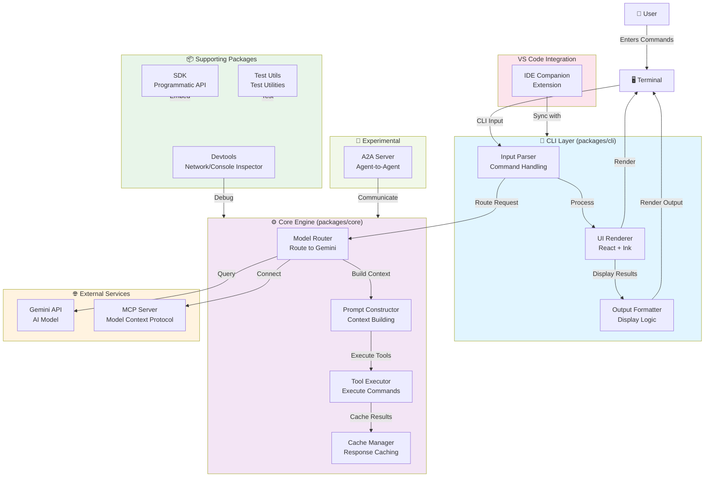
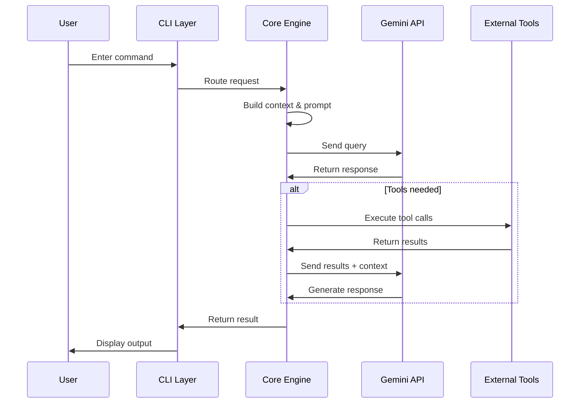
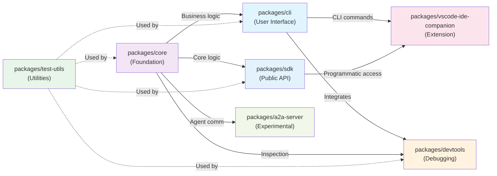
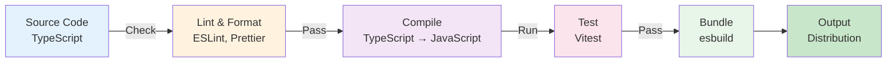

# Gemini CLI Architecture Overview

This document provides a visual overview of the Gemini CLI project architecture, including key components, packages, and their relationships.

## System Architecture



## Component Details

### CLI Layer (`packages/cli`)
- **Input Parser**: Handles command-line argument parsing and user input
- **UI Renderer**: React-based terminal UI powered by [Ink](https://github.com/vadimdemedes/ink)
- **Output Formatter**: Formats and displays results back to the user

### Core Engine (`packages/core`)
- **Model Router**: Routes queries to appropriate Gemini models based on request type
- **Prompt Constructor**: Builds optimized prompts with context and history
- **Tool Executor**: Executes external tools and commands as directed by the model
- **Cache Manager**: Manages response caching to improve performance

### External Services
- **Gemini API**: Google's AI model providing intelligence and reasoning
- **MCP Server**: Model Context Protocol integration for extensibility

### Supporting Packages
- **SDK** (`packages/sdk`): Allows programmatic embedding of Gemini CLI capabilities
- **Devtools** (`packages/devtools`): Integrated network and console inspection tools
- **Test Utils** (`packages/test-utils`): Shared testing utilities and test rigs

### VS Code Integration
- **IDE Companion** (`packages/vscode-ide-companion`): VS Code extension for paired IDE experience

### Experimental
- **A2A Server** (`packages/a2a-server`): Agent-to-Agent communication server

## Data Flow



## Technology Stack

| Layer | Technology |
|-------|-----------|
| **Runtime** | Node.js >= 20.0.0 |
| **Language** | TypeScript |
| **UI Framework** | React + Ink (CLI) |
| **Testing** | Vitest |
| **Bundling** | esbuild |
| **Package Management** | npm workspaces |
| **Code Quality** | ESLint, Prettier |

## Monorepo Structure

```
gemini-cli/
├── packages/
│   ├── cli/                      # User-facing terminal UI
│   ├── core/                     # Backend logic & Gemini orchestration
│   ├── sdk/                      # Programmatic SDK
│   ├── devtools/                 # Developer tools
│   ├── test-utils/               # Shared test utilities
│   └── vscode-ide-companion/     # VS Code extension
├── integration-tests/            # E2E integration tests
├── evals/                        # Evaluation scripts
├── docs/                         # Documentation
├── scripts/                      # Build & utility scripts
├── package.json                  # Root workspace config
├── tsconfig.json                 # Shared TypeScript config
├── .github/                      # GitHub workflows & actions
├── .vscode/                      # Shared VS Code settings
└── .allstar/                     # Branch protection config
```

### Detailed Package Descriptions

#### Core Packages

**`packages/cli`** - Entry Point & User Interface
- **Purpose**: Main user-facing CLI application
- **Key Responsibilities**:
  - Command parsing and argument handling
  - React-based terminal UI rendering (Ink framework)
  - User input processing and validation
  - Output formatting and styling
  - REPL (Read-Eval-Print Loop) implementation
- **Dependencies**: Depends on `core`, `sdk`, `devtools`
- **Entry Point**: `bin/gemini` or `npm run start`
- **Test Suite**: Unit tests for CLI interactions and UI components

**`packages/core`** - Business Logic & AI Orchestration
- **Purpose**: Heart of the application; handles all AI/Gemini interactions
- **Key Responsibilities**:
  - Model routing and selection logic
  - Prompt construction and optimization
  - Tool execution management
  - Response caching layer
  - Context management for multi-turn conversations
  - File system and code reading operations
- **Dependencies**: None (foundational package)
- **Exports**: Core API types and functions used by other packages
- **Test Suite**: Comprehensive unit tests; integration tests with Gemini API

**`packages/sdk`** - Programmatic API
- **Purpose**: Allows third-party developers to embed Gemini CLI programmatically
- **Key Responsibilities**:
  - Public API surface for library consumers
  - Type definitions and interfaces
  - Session management for library usage
  - Error handling and standardized responses
  - Documentation and examples
- **Dependencies**: Depends on `core`
- **Usage**: NPM package for programmatic integration
- **Exports**: Main public API functions and types

#### Supporting Packages

**`packages/devtools`** - Development & Debugging Tools
- **Purpose**: Provides built-in debugging and inspection capabilities
- **Key Responsibilities**:
  - Network request inspection
  - Console message logging
  - Performance profiling
  - API call tracing
  - Error stack traces and debugging info
- **Dependencies**: Depends on `core`
- **Features**: Integrated dashboard accessible during CLI execution

**`packages/test-utils`** - Shared Testing Infrastructure
- **Purpose**: Centralized testing utilities used across all packages
- **Key Responsibilities**:
  - Mock factories for common objects
  - Test fixtures and sample data
  - Custom test assertions and matchers
  - Test database setup/teardown
  - Integration test helpers
  - Vitest configuration presets
- **Dependencies**: None (utility-only package)
- **Usage**: Imported in test files across the monorepo

#### Integration & Extensions

**`packages/vscode-ide-companion`** - VS Code Extension
- **Purpose**: Seamless integration with VS Code editor
- **Key Responsibilities**:
  - VS Code extension host
  - Command palette integration
  - Sidebar UI for chat and file context
  - Code editor integration and inline suggestions
  - Synchronization with CLI state
  - Settings and configuration management
- **Dependencies**: Depends on `sdk`, `core`
- **Build**: Separate build pipeline using `esbuild`
- **Distribution**: Published to VS Code Marketplace

**`packages/a2a-server`** (Experimental) - Agent-to-Agent Communication
- **Purpose**: Enable communication between multiple Gemini agents
- **Key Responsibilities**:
  - WebSocket or gRPC server implementation
  - Message routing between agents
  - State synchronization
  - Distributed execution support
- **Status**: Experimental/Development
- **Dependencies**: Depends on `core`

### Root Level Directory Structure

**`integration-tests/`** - End-to-End Tests
- Complete workflow tests
- Gemini API integration tests
- Multi-step scenario testing
- Performance benchmarks
- Real-world usage simulation

**`evals/`** - Evaluation & Assessment Scripts
- Model response evaluation
- Quality metrics and scoring
- Prompt effectiveness testing
- Benchmark comparisons

**`docs/`** - Documentation
- API documentation
- Architecture diagrams and guides
- Contributing guidelines
- Deployment instructions
- Troubleshooting guides

**`scripts/`** - Build & Utility Scripts
- `build.sh` - Build all packages
- `build:packages.sh` - Build workspace packages only
- `auth.sh` - Docker authentication
- `release.sh` - Release automation
- Linting and formatting scripts

**`.github/`** - CI/CD & Workflows
- GitHub Actions workflows
- PR templates
- Issue templates
- Copilot instructions
- Branch protection rules

**`.vscode/`** - Shared Configuration
- `launch.json` - Debug configurations
- `settings.json` - Editor preferences
- `tasks.json` - Build tasks
- `extensions.json` - Recommended extensions

**`.gcp/`** - Google Cloud Build Configuration
- `development-worker.yml` - Development image builds
- `release-docker.yml` - Production release builds
- `Dockerfile.development` - Development container

### Dependency Graph



### Build & Development Commands (npm workspaces)

```bash
# Build all packages
npm run build

# Build only workspace packages
npm run build:packages

# Run tests across all packages
npm run test

# Run integration tests
npm run test:e2e

# Lint and format all code
npm run lint
npm run format

# Clean all build artifacts
npm run clean

# Build and start CLI
npm run build-and-start

# Debug specific package
npm run test -w packages/core -- --inspect-brk
```

### Package Dependencies Summary

| Package | Purpose | Depends On |
|---------|---------|-----------|
| **test-utils** | Shared test infrastructure | None |
| **core** | Main AI engine | test-utils |
| **sdk** | Public programmatic API | core |
| **cli** | User terminal interface | core, sdk, devtools |
| **devtools** | Developer tools | core |
| **vscode-ide-companion** | VS Code extension | sdk, core |
| **a2a-server** | Agent communication | core |

---

## Build Pipeline



## Development Workflow

1. **Clone & Install**: `npm install`
2. **Build**: `npm run build`
3. **Run**: `npm run start` (development mode)
4. **Debug**: `npm run debug` (Node.js inspector enabled)
5. **Test**: `npm run test` (unit tests) or `npm run test:e2e` (integration tests)
6. **Validate**: `npm run preflight` (comprehensive checks before PR submission)

## Key Features

- **Terminal-First**: Optimized for CLI workflows
- **Extensible**: MCP support for custom integrations
- **Powerful**: Full access to Gemini's reasoning and code capabilities
- **Developer-Friendly**: Built-in debugging tools and comprehensive test suite
- **Cross-Platform**: Works on macOS, Linux, and Windows

---

*For more details, see the [Contributing Guide](../CONTRIBUTING.md) and [Project README](../README.md).*
