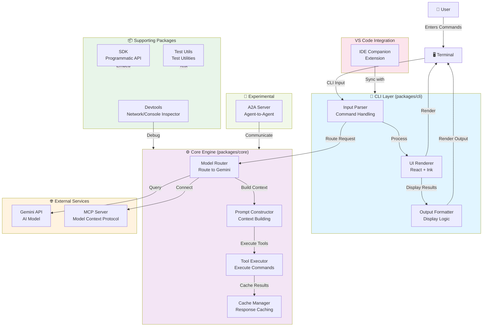
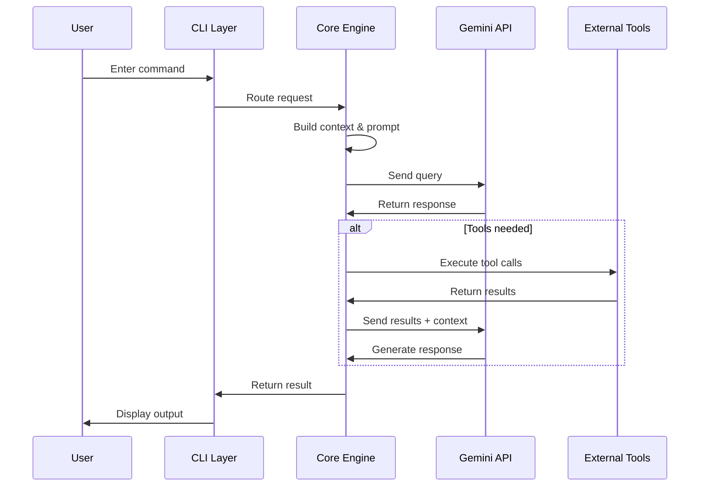
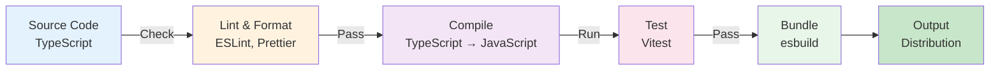

# Gemini CLI Architecture Overview

This document provides a visual overview of the Gemini CLI project architecture, including key components, packages, and their relationships.

## System Architecture



## Component Details

### CLI Layer (`packages/cli`)
- **Input Parser**: Handles command-line argument parsing and user input
- **UI Renderer**: React-based terminal UI powered by [Ink](https://github.com/vadimdemedes/ink)
- **Output Formatter**: Formats and displays results back to the user

### Core Engine (`packages/core`)
- **Model Router**: Routes queries to appropriate Gemini models based on request type
- **Prompt Constructor**: Builds optimized prompts with context and history
- **Tool Executor**: Executes external tools and commands as directed by the model
- **Cache Manager**: Manages response caching to improve performance

### External Services
- **Gemini API**: Google's AI model providing intelligence and reasoning
- **MCP Server**: Model Context Protocol integration for extensibility

### Supporting Packages
- **SDK** (`packages/sdk`): Allows programmatic embedding of Gemini CLI capabilities
- **Devtools** (`packages/devtools`): Integrated network and console inspection tools
- **Test Utils** (`packages/test-utils`): Shared testing utilities and test rigs

### VS Code Integration
- **IDE Companion** (`packages/vscode-ide-companion`): VS Code extension for paired IDE experience

### Experimental
- **A2A Server** (`packages/a2a-server`): Agent-to-Agent communication server

## Data Flow



## Technology Stack

| Layer | Technology |
|-------|-----------|
| **Runtime** | Node.js >= 20.0.0 |
| **Language** | TypeScript |
| **UI Framework** | React + Ink (CLI) |
| **Testing** | Vitest |
| **Bundling** | esbuild |
| **Package Management** | npm workspaces |
| **Code Quality** | ESLint, Prettier |

## Monorepo Structure

```
gemini-cli/
├── packages/
│   ├── cli/                 # User-facing terminal UI
│   ├── core/                # Backend logic & Gemini orchestration
│   ├── sdk/                 # Programmatic SDK
│   ├── devtools/            # Developer tools
│   ├── test-utils/          # Shared test utilities
│   └── vscode-ide-companion/# VS Code extension
├── integration-tests/       # E2E integration tests
├── evals/                   # Evaluation scripts
├── docs/                    # Documentation
└── scripts/                 # Build & utility scripts
```

## Build Pipeline



## Development Workflow

1. **Clone & Install**: `npm install`
2. **Build**: `npm run build`
3. **Run**: `npm run start` (development mode)
4. **Debug**: `npm run debug` (Node.js inspector enabled)
5. **Test**: `npm run test` (unit tests) or `npm run test:e2e` (integration tests)
6. **Validate**: `npm run preflight` (comprehensive checks before PR submission)

## Key Features

- **Terminal-First**: Optimized for CLI workflows
- **Extensible**: MCP support for custom integrations
- **Powerful**: Full access to Gemini's reasoning and code capabilities
- **Developer-Friendly**: Built-in debugging tools and comprehensive test suite
- **Cross-Platform**: Works on macOS, Linux, and Windows

---

*For more details, see the [Contributing Guide](../CONTRIBUTING.md) and [Project README](../README.md).*
